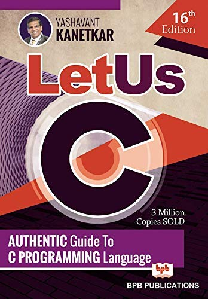

# LetUs-C


My solutions for Exercises in Let Us C book by Yashvant Kanetkar

<!--  -->

## 🤗 Contributions
If you find any issue or find any solution incorrect feel free to create an [issue](https://github.com/yashppawar/LetUs-C/issues).

## Running the code.
Compile the code files `*.c` and run the executables, linux executables are already present, the files without extension are most probably executables, they can be just run directly by providing the path to them.
to compile recommended to use GCC or CLang.
```bash
$ clang ./filename.c -o filename
$ ./filename
```
or 
```bash
$ gcc ./filename.c -o filename
$ ./filename
```
alternatively you can use `make` 
```bash
$ make filename
$ ./filename
```
